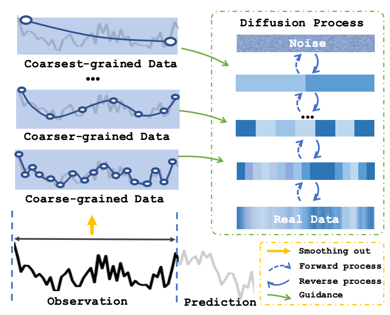
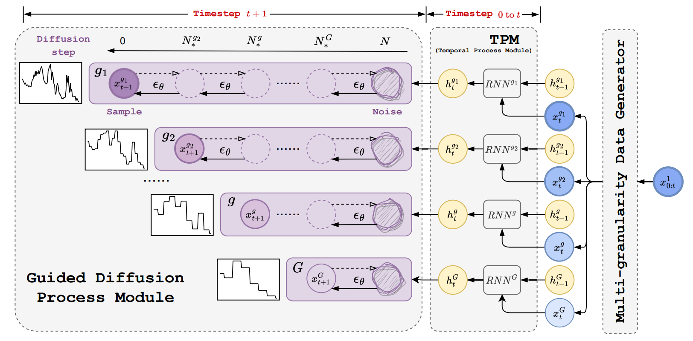
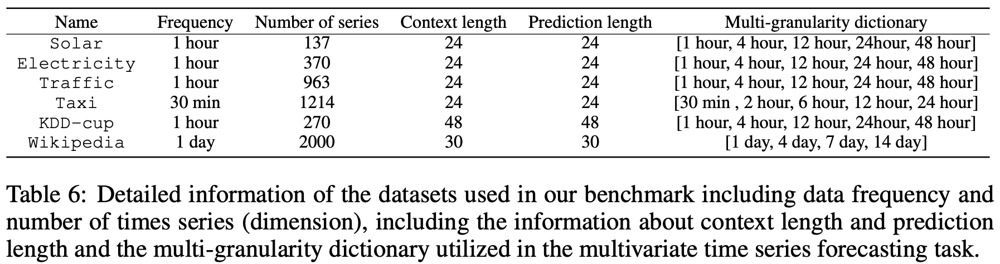
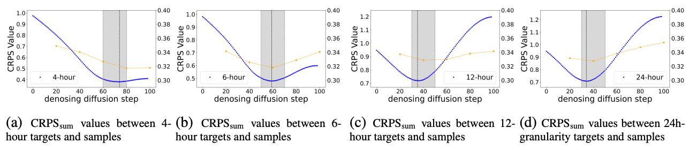
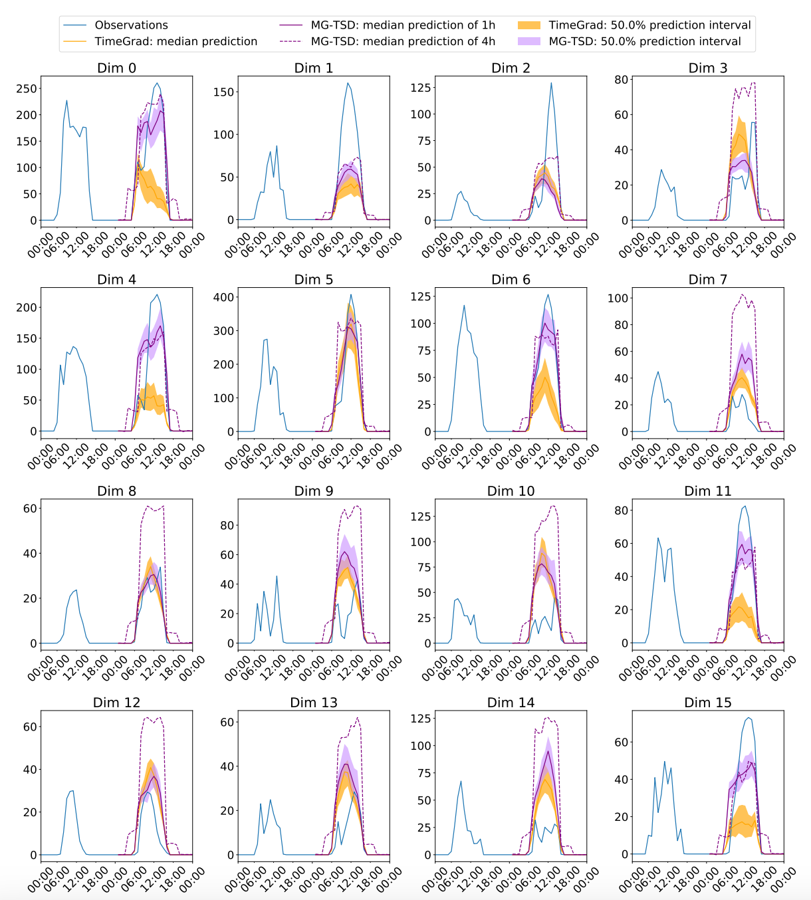

# MG-TSD-code
MG-TSD: Multi-Granularity Time Series Diffusion Models with Guided Learning Process

paper in https://openreview.net/forum?id=CZiY6OLktd

Diffusion probabilistic models have the capacity to generate high-fidelity samples for generative time series forecasting; however, they also present issues of instability due to their stochastic nature. In order to tackle this challenge, we present a novel approach called [Multi-Granularity Time Series Diffusion (MG-TSD)](https://openreview.net/forum?id=CZiY6OLktd), which capitalizes on the intrinsic granularity levels present in the data, utilizing them as predefined targets at various stages of the diffusion process. These targets are used to guide the learning trajectory of the diffusion models, ensuring a more stable and accurate forecast.

In the field of long-term forecasting, the Multi-Granularity Time Series Diffusion (MG-TSD) model has established a new state-of-the-art, showcasing a notable relative improvement that spans from 4.7% to 35.8% across six benchmarks.

## Main Idea

We observe that the forward process of the diffusion model, which sequentially corrupts the data distribution to a standard normal distribution, intuitively aligns with the process of smoothing fine-grained data into a coarser-grained representation, both of which result in a gradual loss of finer distribution features.
This provides the insights that intrinsic features within data granularities may also serve as a source of guidance.

<p align="center">  
  
<br/>
Figure1: The process of smoothing data from
finest-grained to coarsest-grained naturally aligns
with the diffusion process
</p>  


In this paper, we propose a novel **M**ulti-**G**ranularity **T**ime **S**eries **D**iffusion (MG-TSD) model that leverages multiple granularity levels within data to guide the learning process of diffusion models. The coarse-grained data at different granularity levels are utilized as targets to guide the learning of the denoising process. These targets serve as constraints for the intermediate latent states, ensuring a regularized sampling path that preserves the trends and patterns within the coarse-grained data. They introduce inductive bias which promotes the generation of coarser features during intermediate steps and facilitates the recovery of finer features in subsequent diffusion steps. Consequently, this design reduces variability and results in high-quality predictions.

<p align="center">  
  
<br/>
Figure2: Overview of the Multi-Granularity Time Series Diffusion (MG-TSD) model
</p>  


## Quick start
```
conda create -n mgtsd python=3.9.12
conda activate mgtsd
pip install -r requirements.txt
bash scripts/run_mgtsd.sh
```

The detailed descriptions about the arguments are as following:
| Parameter Name     | Description                                                                                                        |
| ------------------ | ------------------------------------------------------------------------------------------------------------------ |
| `num_gran`         | The number of granularity levels, which should correspond to the length of `mg_dict`.                              |
| `mg_dict`          | A list defining multiple granularity intervals, e.g., '1_4' for 1 hour and 4 hours, '1_4_8' for 1, 4, and 8 hours. |
| `share_ratio_list` | A list detailing the share ratios; '1_0.9' indicates a 90% share of diffusion steps with the finest granularity.   |
| `weight_list`      | A list of weights for each granularity level; '0.9_0.1' assigns 0.9 to the first level and 0.1 to the second.      |
| `log_metrics`      | Toggle for logging metrics to Weights & Biases (wandb) during training, which may affect training speed.           |
| `wandb_space`      | The designated space name for wandb logging.                                                                       |
| `wandb_key`        | Your personal wandb access key (please replace with your actual key).                                              |


Alternatively, you can also directly run the following command to train and test with different settings.

Setting 1: Perform experiments with 3 granularities on the Solar dataset. 
``` bash
python src/run_mgtsd.py \  
  --result_path "./" \  
  --model_name "mgtsd" \  
  --epoch 30 \  
  --cuda_num 0 \  
  --dataset "solar" \  
  --diff_steps 100 \  
  --batch_size 128 \  
  --num_cells 128 \  
  --mg_dict "1_4_12" \  
  --num_gran 3 \  
  --share_ratio_list "1_0.8_0.6" \  
  --weight_list "0.8_0.1_0.1" \  
  --run_num 1 \  
  --log_metrics False  
```
Setting 2: Perform experiments with 4 granularities on the Solar dataset and log the metrics to Weights & Biases (wandb) during the process.


``` bash
python src/run_mgtsd.py \  
  --result_path "./" \  
  --model_name "mgtsd" \  
  --epoch 30 \  
  --cuda_num 0 \  
  --dataset "solar" \  
  --diff_steps 100 \  
  --batch_size 128 \  
  --num_cells 128 \  
  --mg_dict "1_4_12_24" \  
  --num_gran 4 \  
  --share_ratio_list "1_0.8_0.6_0.6" \  
  --weight_list "0.7_0.1_0.1_0.1" \  
  --run_num 1 \  
  --log_metrics True \  
  --wandb_space mgtsd \  
  --wandb_key your-personal-wandb-access-key
```

## A Simple Example
see `src/example.ipynb` for more information.

## Data
Run the `scripts/run_mgtsd.sh` and the data will be automatically downloaded to `~/.mxnet/gluon-ts/`.



## Result

Our comprehensive evaluation across six benchmarks and three performance metrics involved a comparison with nine baseline models. The results demonstrate that our model secures the state-of-the-art (SOTA) status, achieving a substantial improvement ranging from 4.7% to 35.8% on the $\text{CRPS}\_{\text{sum}}$ metric across the six benchmarks.

### The empirical study of insight
In Figure 3(a)-(d), the dashed blue curve in each plot represent $\text{CRPS}\_{\text{sum}}$ values between the coarse-grained targets and 1-hour samples come from 1-gran (finest-gran) model at each intermediate denoising step\; each point on the orange polylines represents the $\text{CRPS}\_{\text{sum}}$ value of 1-hour predictions by 2-gran MG-TSD models (where one coarse granularity is utilized to guide the learning process for the finest-grained data), with different share ratios ranging from [0.2, 0.4, 0.6, 0.8, 1.0], and the lowest point of the line segment can be used to characterize the most suitable share ratio for the corresponding granularity.

The four subplots from (a) to (d) illustrate a gradual smoothing transformation of the distribution of increasingly coarser targets. A key observation is that from the left to the right panel, the distribution of coarser targets gradually aligns with the distribution of intermediate samples at larger diffusion steps. More specifically, as granularity transitions from fine to coarse (4h→6h→12h→24h), the denoising steps at which the distribution most resembles the coarse-grained targets increase (approximately at steps 80→60→40→40). This comparison underscores the similarity between the diffusion process and the smoothing process from the finest-grained data to coarse-grained data, both of which involve a gradual loss of finer characteristics from the finest-grained data through a smooth transformation.

<p align="center">  
  
<br/>
Figure 3: Selection of share ratio for MG-TSD models
</p>  

### Case Study
To illustrate the guidance effect of coarse-grained data, we visualize the ground truth and the predicted mean for both 1-hour and 4-hour granularity time series across four dimensions in the Solar
dataset in Figure 4. In the MG-TSD model, the coarse-grained samples display a more robust capacity to capture the trends, subsequently guiding the generation of more precise fine-grained data.
<p align="center">  
  
<br/>
Figure 4: MG-TSD and TimeGrad prediction intervals and test set ground-truth for Solar data of
some illustrative dimensions of 370 dimensions from first rolling-window.

</p>  

## Citation
If you find this repo useful, please cite our paper.
```
@inproceedings{
fan2024mgtsd,
title={{MG}-{TSD}: Multi-Granularity Time Series Diffusion Models with Guided Learning Process},
author={Xinyao Fan and Yueying Wu and Chang Xu and Yuhao Huang and Weiqing Liu and Jiang Bian},
booktitle={The Twelfth International Conference on Learning Representations},
year={2024},
url={https://openreview.net/forum?id=CZiY6OLktd}
}
```


